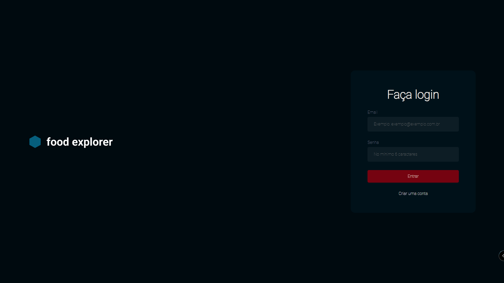
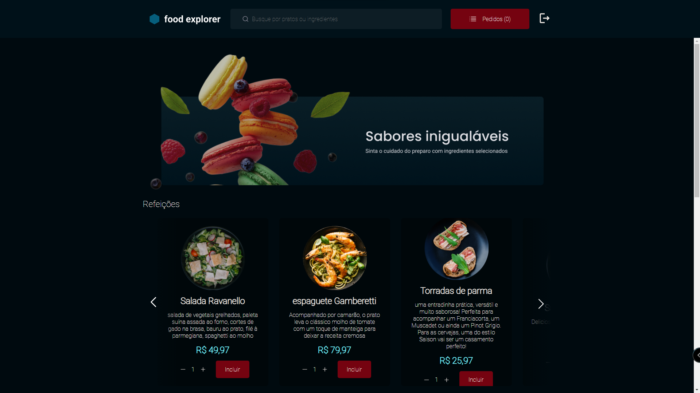
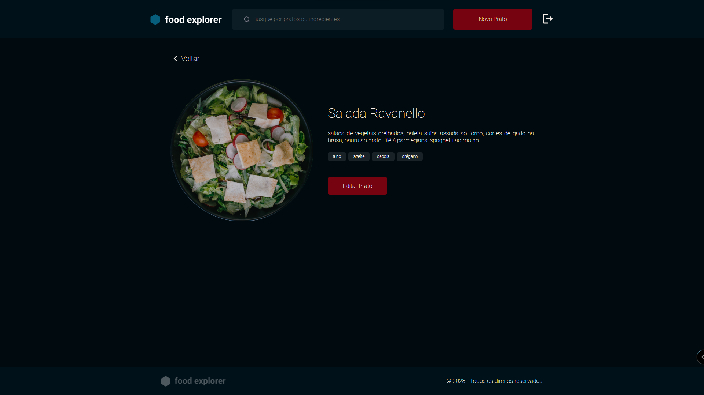
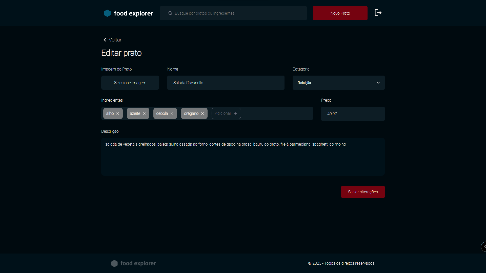
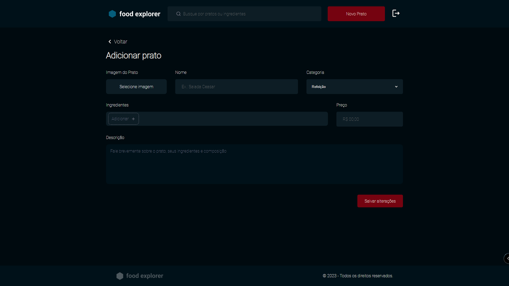

## Projeto FOOD EXPLORER 

Desenvolvido por Nataniel Souza para conclusão do curso Explorer de formação rápida Full Stack da Rocketseat 

O projeto consiste em uma aplicação Front-end desenvolvida com React e back-end desenvolvida com Node.js que simula um sistema de Cadastro, login de usuários, visualização de cardápios, detalhes, contador de pedidos e também visualização diferenciada para usuários administradores um restaurante.

### Passos para executar e realizar testes no projeto: 

1) Baixe os projetos de front e back-end para o computador

2) Abra cada projeto no VSCode 

3) No terminal do VScode, execute 'npm i' em cada projeto

4) Após as instalações de dependências, execute o comando 'npm run dev' em cada projeto

5) No terminal do projeto Front-end aparecerá um ip com a porta para ser acessado no navegador, basta segurar o ctrl e clicar em cima desse ip que o navegador se abrirá para visualizar o front

6) No terminal do projeto Back-end, se tudo correu bem, deve aparecer a mensagem "Server is running on PORT (número da porta)". Atualmente a porta configurada é a 3333 e pode ser trocada no arquivo src/server.js linha 34. OBS: caso aconteça erro na instalação de dependências, principalmente na instalação do sqlite, execute novamente 'npm i' ou tente 'npm install sqlite3 sqlite --save'

7) Para login na página, há um usuário comum sem privilégios de administrador e um usuário com provilégios de administrador. O dados de acesso são:

    User comum
        email@email.com 
        senha 123

    User administrador
        emailadm@email.com  
        senha 123

    OBS: O sistema possui página de cadastro de usuário, porém para criar usuário admin, é necessário usar um software de API Client como o Insomnia e numa requisção POST para localhost:3333/users passar as seguintes informações de login em JSON:
        "name": "",
	    "email": "",
	    "password": "",
	    "isAdmin": true

### observações

Implementações parciais ou não realizadas:
    * pesquisa por nomes dos pratos (não implementada)
    * contador dos pedidos (funcionando parcialmente)
    * página de finalização dos pedidos (não implementada)

### Previews do projeto 

### Contacts

📧 Email: nt.s@live.com   
👤 LinkedIn: [Nataniel Souza](https://www.linkedin.com/in/nataniel-souza)